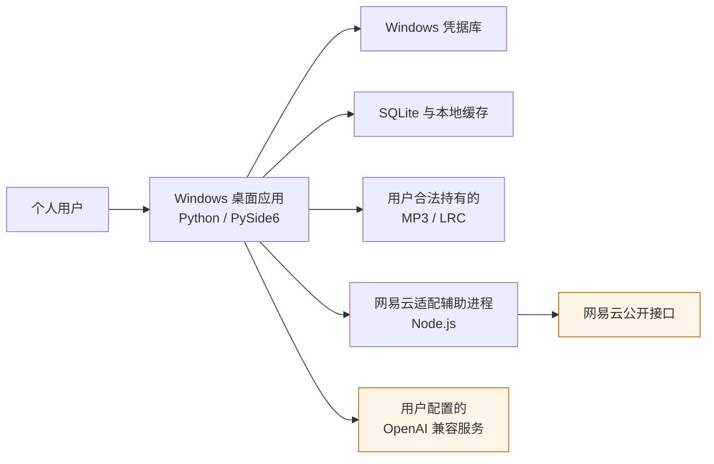
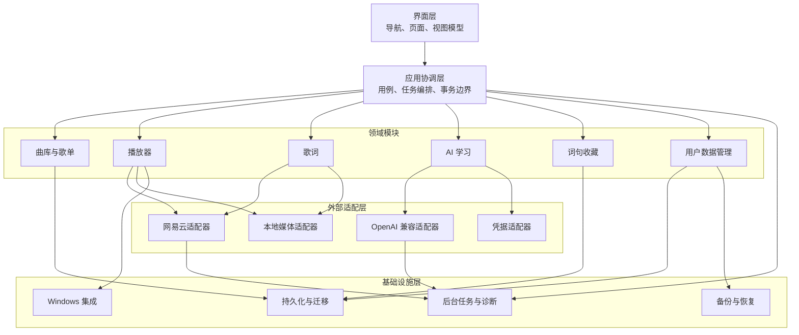
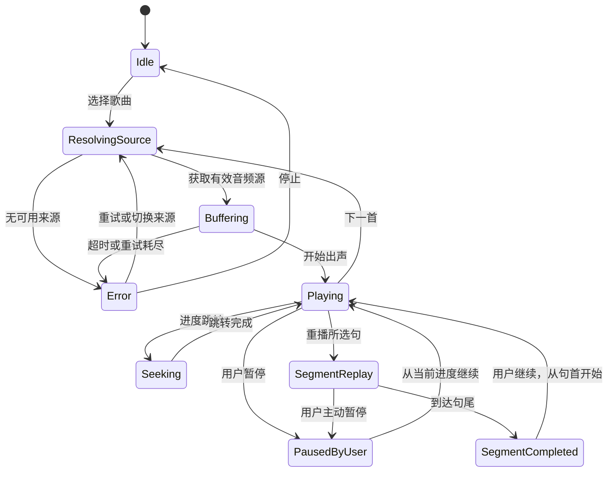
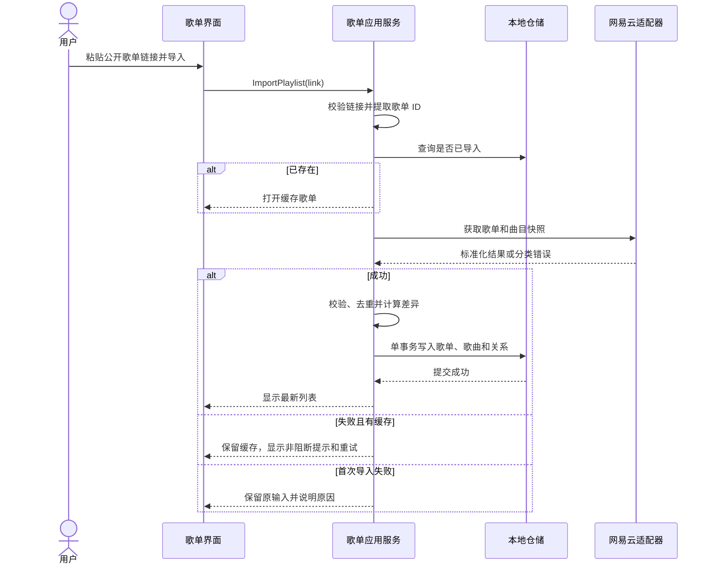
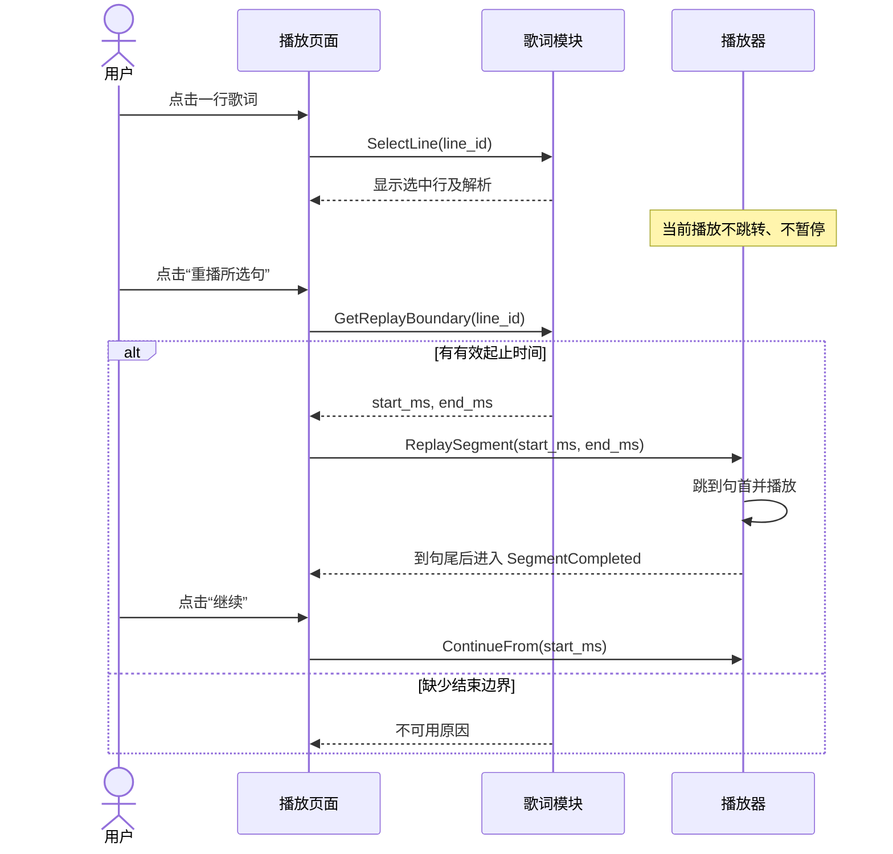
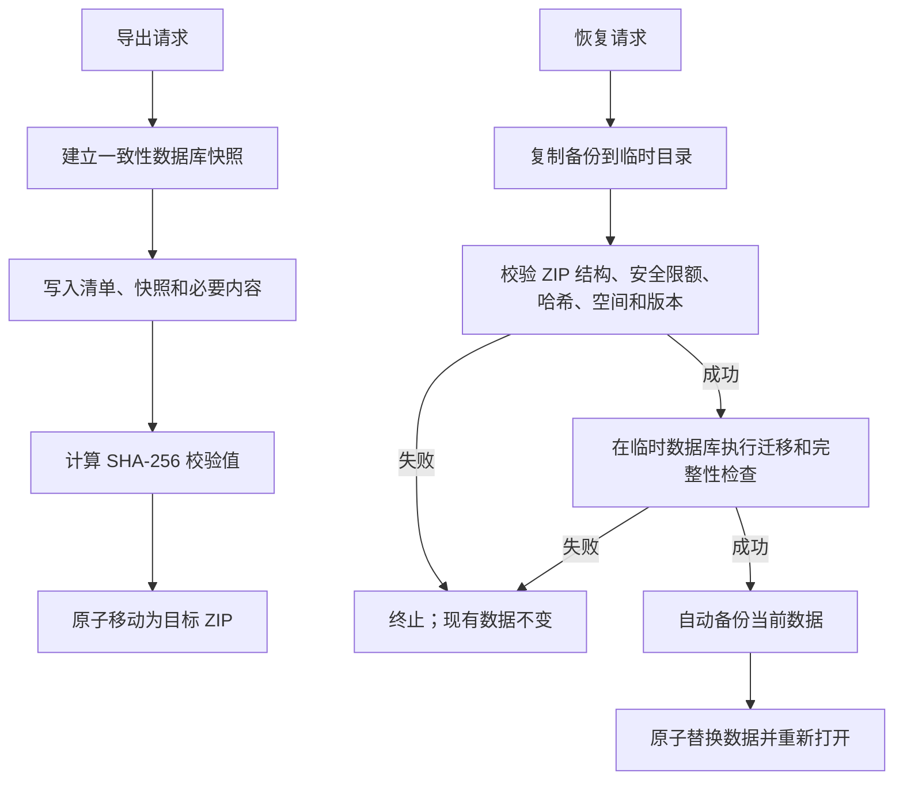
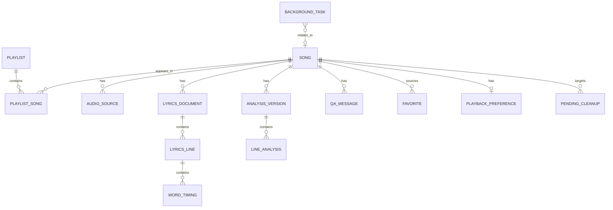

# 英文歌曲歌词学习播放器概要设计文档

| 项目 | 内容 |
| --- | --- |
| 文档版本 | 1.1 |
| 适用版本 | 个人原型第一版（v0.1.0） |
| 需求基线 | `需求/requirements.md` |
| 目标平台 | Windows 10/11 64 位 |
| 文档状态 | 已完成需求审计补强，可供详细设计、开发与测试使用 |

## 1. 文档目的

本文档依据《英文歌曲歌词学习播放器——第一版需求文档》形成第一版概要设计。设计重点以需求第 5 节的功能分组划分核心模块，并结合第 6～14 节补充模块职责、接口、数据模型、异常处理和质量约束。

本文档用于：

- 统一系统边界、模块职责、模块依赖和关键技术决策；
- 为详细设计、数据库建模、接口实现、测试设计和安装包制作提供基线；
- 保证后续实现能够从需求追踪到模块、接口和验收项；
- 隔离网易云和 AI 等不稳定外部依赖，避免其故障损坏本地数据或阻断已有能力。

关键设计决策记录在 `doc/decision-log.md`，需求审计问题的逐条闭环记录在 `doc/traceability.md`。两者只解释和追踪需求，不替代或降低 `需求/requirements.md` 的优先级。

若需求范围、关键行为或验收标准发生变化，应先更新 `需求/requirements.md` 并确认，再同步修改本文档。

## 2. 设计范围和边界

### 2.1 范围内

- Windows 单窗口桌面应用及系统托盘、媒体键等系统集成；
- 网易云公开歌单链接导入、缓存、后台刷新和在线流式播放；
- 本地 MP3/LRC 兜底关联；
- 逐行/逐词歌词显示、时间偏移和所选句重播；
- 用户主动发起的整首歌词 AI 解析、逐行编辑和按歌曲问答；
- 词句选取、语境释义、收藏、搜索和筛选；
- 本地数据存储、清理、备份、恢复和版本迁移；
- 外部依赖故障隔离、后台任务、诊断日志和用户可理解的错误提示。

### 2.2 范围外

第一版不实现软件账号、会员、支付、产品方 AI 代理、云同步、网易云登录、私人歌单、其他音乐平台、永久音频下载、DRM 绕过、语音识别、移动端、Web 端、多用户、随机播放、记忆卡或系统课程等需求第 13 节列出的内容。

### 2.3 设计原则

1. **本地优先**：曲库、歌词、学习数据和设置以本地持久化数据为准；远端刷新不得破坏已有数据。
2. **播放优先**：后台刷新、AI 请求和数据维护不得阻塞播放线程或界面主线程。
3. **用户主动学习**：不自动调用 AI、不自动选择或收藏词句、不因查看解析而改变播放状态。
4. **外部依赖可替换**：网易云和 OpenAI 兼容服务通过端口接口接入，领域层不依赖其具体响应格式。
5. **失败保持旧值**：刷新、解析、恢复或迁移失败时，旧数据保持可读且不被不完整结果覆盖。
6. **依赖单向**：界面只能通过应用服务访问领域能力；外部适配器和界面不得直接写数据库。
7. **显式状态**：加载、选中、错误、受限和不可用状态同时使用文字或图标表达，不只依赖颜色。
8. **外部内容不可信**：网易云、AI、备份和本地 LRC 的文本及文件结构一律先校验，再以纯文本展示或进入领域模型，不解释为 HTML/Markdown，也不执行其中的链接或脚本。
9. **破坏性操作需当下授权**：等待期届满、恢复备份或后台调度不得代替用户对物理删除、全量清除等操作的当次明确确认。

## 3. 技术基线

| 领域 | 技术选择 | 用途与约束 |
| --- | --- | --- |
| 主语言 | Python 3.12 | 主应用、业务逻辑和桌面功能 |
| 桌面界面 | PySide6 | 单窗口、侧栏、列表、歌词和解析界面 |
| 异步协调 | `asyncio` + `qasync` | 将 Qt 事件循环与异步网络/任务协调；禁止在 UI 线程执行阻塞 I/O |
| 播放引擎 | Qt Multimedia | 在线流、本地 MP3、进度、音量和播放状态；实现前以可行性验证确认请求头、Range 和跳转能力 |
| 数据库 | SQLite + SQLAlchemy 2 | 单用户关系数据和事务 |
| 迁移 | Alembic | 数据库版本升级、回退兼容和迁移脚本管理 |
| 网易云适配 | Node.js LTS 子进程 | 隔离非官方接口变化；不得直接访问数据库 |
| 进程通信 | `127.0.0.1` HTTP/JSON | 随机端口、单次会话令牌、超时、健康检查和受控退出 |
| AI 接口 | OpenAI Chat Completions 兼容基线 | 支持时使用 JSON Schema；否则采用严格 JSON 输出和本地校验 |
| 凭据 | Windows Credential Manager | 仅保存 AI API 密钥；数据库、日志、备份和 Git 不保存密钥 |
| 备份 | 版本化 ZIP + SHA-256 | 单文件、不加密；不包含密钥、临时缓存和原始媒体 |
| 打包 | PyInstaller | 生成无需用户安装 Python 的 Windows 安装内容；仅在 `ONLINE_GATE_PASSED` 构建中携带 Node 运行时和网易云适配层 |
| 测试 | pytest、pytest-qt、异步测试及契约测试 | 单元、集成、界面、适配器、迁移和恢复验证 |

依赖应在锁定文件中固定到经过验收的具体版本。大版本升级必须重新运行播放、歌词同步、数据库迁移和安装包测试。

## 4. 系统上下文



系统仅监听回环地址，不对局域网或互联网提供入站服务。Node.js 辅助进程只负责外部接口适配和响应标准化，不持有业务数据库连接。Python 主应用是所有持久化写入和业务规则的唯一执行者。

## 5. 总体架构

### 5.1 架构风格

主应用采用**分层的模块化单体**。各功能在同一 Python 进程内运行，通过明确的应用服务和端口接口协作；网易云适配因依赖和故障特征单独放入本地 Node.js 子进程。



### 5.2 依赖规则

- 界面层依赖应用服务接口和只读视图模型，不持有数据库会话。
- 应用协调层负责用例编排、权限/前置条件、事务开始与提交，以及向界面发布结果。
- 领域模块表达稳定业务规则，不包含 Qt 控件、HTTP 库、SQLAlchemy 模型或第三方响应字段。
- 基础设施层实现存储、迁移、文件、诊断和操作系统能力。
- 外部适配层把第三方响应转换为内部 DTO；转换成功后由应用服务决定是否持久化。
- 模块间禁止循环调用。需要跨模块协作时由应用服务编排，或发布进程内领域事件。

### 5.3 运行时与并发

- UI 主线程仅执行渲染、短时状态更新和 Qt 必须在主线程执行的播放控制。
- 网络访问、备份校验、数据清理和 AI 请求使用可取消异步任务；CPU 密集解析或文件校验放入受控工作线程。
- 播放状态由播放引擎回调统一进入 `PlaybackCoordinator`，再更新歌词同步器和界面，避免多个组件直接订阅底层播放器并各自改变状态。
- 每类资源设置并发上限：歌单刷新串行或小并发、单首歌曲同类 AI 任务互斥、数据库写入使用短事务。
- 关闭应用时先停止接收新任务，再取消可取消任务、保存必要播放状态、终止辅助进程，最后关闭数据库。

## 6. 模块设计

### 6.1 导航与页面模块

**对应需求：5.1。**

职责：

- 管理单窗口壳、侧栏导航和页面生命周期；
- 提供歌单、正在播放、词句收藏和设置入口；
- 组织“歌词主区 + 解析侧栏”的播放页面；
- 将应用服务状态转换为加载、空、正常、不可用和错误视图；
- 管理应用快捷键、焦点顺序、文字缩放和非纯色状态表达；
- 关闭窗口时显示“退出并停止播放”或“缩小到系统托盘”。

主要组件：

- `MainWindowShell`：窗口、侧栏、托盘和全局通知；
- `NavigationService`：页面路由和选中状态；
- `PlaylistViewModel`、`NowPlayingViewModel`、`FavoritesViewModel`、`SettingsViewModel`；
- `ShortcutController`：空格、方向键和页面内快捷键；
- `AccessibilityController`：文字缩放、焦点和可访问名称。

边界：该模块不解析外部响应、不执行 SQL、不直接控制 AI 请求，也不自行推断播放队列或句子边界。

### 6.2 曲库与歌单模块

**对应需求：5.2、6.1。**

职责：

- 校验并规范化网易云公开歌单链接，提取稳定歌单 ID；
- 导入歌单元数据和最多 500 首曲目，按远端 ID 去重；
- 启动时先读取缓存，再在后台刷新所有已导入歌单；
- 重复导入时打开并刷新已有歌单，而非创建副本；
- 用“歌曲”和“歌单歌曲关系”分离模型支持跨歌单复用；
- 刷新失败时保留上次缓存，并记录可重试错误；
- 删除歌单关系，识别孤立歌曲并进入 30 天待清理期；
- 歌单重新出现或歌曲重新被引用时撤销对应待清理标记。
- 在线歌单、音频和歌词能力受第 13.1 节验证门控制；验证门未通过时，应用状态必须为 `PARTIAL_OFFLINE`，不得向网易云适配器发起业务请求。

主要应用服务：

- `ImportPlaylist(link)`；
- `RefreshPlaylist(playlist_id)`、`RefreshAllPlaylists()`；
- `GetPlaylistDetail(playlist_id)`；
- `DeletePlaylist(playlist_id)`、`RestorePendingData(cleanup_id)`；
- `RetryInvalidPlaylist(playlist_id)`。

刷新采用“远端快照标准化 → 差异计算 → 单事务应用”的方式。远端缺失不得直接解释为本地学习数据应删除；只更新歌单关系和可用状态。

### 6.3 播放器模块

**对应需求：5.3、6.2、6.3、7.4。**

职责：

- 维护当前播放队列、当前索引、顺序播放/列表循环模式和音量；
- 提供播放、暂停、上一首、下一首、进度跳转；
- 点击歌曲时以其所在歌单创建队列并从该歌曲开始；
- 按需求规定解析音频源：默认先尝试在线临时地址；只有在线不可用，或用户对当前歌曲显式选择本地来源时，才使用有效本地关联。来源选择结果必须在界面可见且可切回在线；
- 在线地址按需获取，不永久保存；临时音频缓存使用独立目录和集中策略，默认 TTL 不超过 24 小时、磁盘总配额不超过 512 MiB，超额按最近最少使用顺序清理；启动时必须先删除过期项并将缓存压回配额，退出时尽力清理但不能把退出清理当作唯一保障；
- 映射版权、地区、会员、接口、网络和本地文件错误；
- 支持最小化/切换应用后继续播放、系统媒体键和托盘控制；
- 执行所选句重播状态机，并在结束边界暂停。

播放状态机：



`SegmentReplay` 必须使用歌词模块提供的有效起止边界；无有效结束时间时不进入该状态。`PausedByUser` 保存普通暂停位置，`SegmentCompleted` 则保存本次重播的句首位置；只有从 `SegmentCompleted` 执行“继续”才从句首恢复，普通暂停的“继续”必须从当前进度恢复。普通点击歌词不得调用播放器跳转接口。

### 6.4 用户数据管理模块

**对应需求：5.4、9.1、9.2。**

职责：

- 查看、编辑和删除 AI 解析、问答及词句收藏；
- 按英文、中文和来源歌曲查询收藏，默认最近收藏优先；
- 分项清理临时缓存、问答、解析或曲库；
- 执行全量本地数据清除：显示数据类别和不可逆影响并要求二次确认；成功后同时删除本应用在 Windows 凭据库中的全部凭据，但绝不删除原始媒体文件；
- 管理 30 天待清理数据、恢复和到期后的“可清除”状态；到期本身不授权物理删除；
- 导出、验证和恢复单文件备份；
- 在数据格式升级前创建版本备份。

删除规则：

1. 删除歌单只删除歌单及关系；仍被其他歌单引用的歌曲不受影响。
2. 引用数归零的歌曲、歌词和学习数据标记 `pending_cleanup`，设置 `purge_after = created_at + 30 天`。
3. 30 天内用户可恢复；再次导入或重新建立引用也自动恢复。
4. 到期任务只把记录转为 `awaiting_purge_confirmation` 并通知用户，不得自动物理删除。
5. 用户在到期后进入数据管理页，查看拟删除类别、数量和不可恢复提示并再次明确确认后，系统才生成一次性 `purge_authorization`；执行前仍须重新计算引用数并检查恢复标记，检查不通过则取消删除。授权不得跨批次、跨重启复用。
6. 物理删除按依赖顺序在单事务中完成；本地 MP3/LRC 只删除关联记录，绝不删除原文件。

### 6.5 歌词模块

**对应需求：7.1～7.5。**

职责：

- 从在线适配器或本地 LRC 获得歌词并标准化；
- 支持纯文本、逐行时间轴和逐词时间轴三种能力级别；
- 根据播放位置、永久偏移量计算当前行和当前词；
- 计算句子重播起止边界；
- 保存、调整和恢复每首歌曲的整体偏移；
- 保留原文和少量非英语内容，向 AI 模块提供标准化全文；
- 歌词损坏时保留可显示文本，并暴露能力降级原因。
- 网易云歌词、翻译、歌名、歌手、专辑、AI 返回文本和本地 LRC 标签统一视为不可信文本；界面必须使用纯文本控件或 `setPlainText` 等等价 API，禁止作为 HTML/Markdown、富文本链接或 WebView 内容渲染。

能力矩阵：

| 歌词能力 | 全文显示 | AI 解析 | 自动同步 | 时间偏移 | 所选句重播 |
| --- | --- | --- | --- | --- | --- |
| 纯文本 | 是 | 是 | 否 | 否 | 否 |
| 逐行时间轴 | 是 | 是 | 是（逐行） | 是 | 有下一行边界时可用 |
| 逐词时间轴 | 是 | 是 | 是（逐行+逐词） | 是 | 有末词边界时可用 |

边界计算统一使用毫秒整数。偏移只参与歌词显示位置和重播边界计算，不修改音频或原始歌词时间戳。

增强型 LRC 的逐词标记存在多种不兼容方言。概要设计只定义“解析真实时间标记、失败时降级且绝不伪造逐词进度”的原则；详细设计必须列出明确支持的方言白名单、时间精度、嵌套/重叠规则、转义与非英语文本处理、冲突优先级和测试语料。该清单及契约测试未完成前，逐词解析功能不得进入开发完成状态。

### 6.6 AI 学习模块

**对应需求：8.1～8.5。**

职责：

- 管理服务地址、模型名、能力探测和非敏感生成参数；
- 从 Windows 凭据端口临时取得 API 密钥并构建请求；
- 仅在用户点击后生成整首解析或词句释义；
- 为每行产生自然中文翻译、表层意思、深层/语境含义和俚语说明；
- 校验结构完整性、歌词行稳定标识和结果数量；
- 保存完整成功结果，不保存不完整结果；失败或取消不覆盖旧版本；
- 支持逐行用户修改并记录“用户修改”；
- 管理按歌曲组织的多轮问答，发送整首歌词、所选行和已有解析作为上下文；
- 每个解析版本和问答会话都绑定创建时的 `lyrics_document_id`、歌词版本及规范化内容 SHA-256；歌词当前版本变化时旧内容标为“基于旧歌词”，不得静默附着到新歌词或参与新问答上下文，用户可查看旧版或显式基于新歌词重新生成；
- 将密钥错误、模型不可用、限额、订阅、网络和格式错误映射为用户可理解错误。

结构化输出策略：

1. 适配器探测服务是否支持 JSON Schema/结构化输出。
2. 支持时发送固定 JSON Schema；不支持时要求只返回严格 JSON。
3. 响应必须通过本地 Schema 校验和业务校验。
4. 校验失败仅记录脱敏诊断摘要，不保存部分解析，也不覆盖旧解析。
5. “重新生成”创建新解析版本；若当前版本包含用户修改，提交前再次确认覆盖风险。

验收基准模型为 `gpt-5.6-terra`。验收记录同时保存服务地址类别、精确模型 ID、提示词版本、参数、测试日期和样本集版本；运行时仍允许用户配置其他兼容模型。

### 6.7 词句收藏模块

**对应需求：8.4。**

职责：

- 接收用户在单行歌词内拖选的一个英文单词或连续短语；
- 校验选择范围，不自动扩展、判断或收藏；
- 用户点击收藏后调用 AI 学习模块生成当前语境释义；
- 保存英文词句、中文解释、原歌词句、来源歌曲、创建时间和个人备注；
- 支持编辑、删除、中英文搜索、来源筛选和最近收藏排序。

收藏项归属于稳定歌曲 ID，但保留创建时的原歌词文本快照，避免歌词替换后失去学习上下文。同一词句可在不同歌曲或不同上下文中分别收藏。

### 6.8 持久化与迁移模块

职责：

- 提供仓储实现、事务工作单元和查询模型；
- 使用 SQLite 外键、唯一约束和索引保持引用完整性；
- 通过 Alembic 管理 Schema 版本；
- 对写入采用短事务和原子替换，避免网络调用期间持有事务；
- 数据格式升级前调用备份服务生成版本备份；
- 对磁盘不足、数据库锁定和完整性错误进行分类处理。

网络响应、AI 原始响应和文件解析结果必须先在事务外完成验证，再进入事务写入。日志中只记录稳定内部标识、错误分类和追踪 ID，不记录密钥或完整问答内容。

### 6.9 外部服务模块

#### 6.9.1 网易云适配器

- Python 端仅依赖 `PlaylistProvider`、`AudioSourceProvider` 和 `LyricsProvider` 端口；
- Node.js 辅助进程封装网易云请求、限流、超时和第三方字段映射；
- 启动时由 Python 生成高熵会话令牌，通过子进程标准输入传入；令牌不写磁盘、不出现在命令行；
- Node.js 只绑定 `127.0.0.1` 随机端口，每次请求校验会话令牌；
- 健康检查通过后才接收业务请求；主程序退出时先请求受控关闭，超时后终止子进程；
- 在线音频地址只在播放前获取并保存在内存，不进入数据库和备份。

原 `Binaryify/NeteaseCloudMusicApi` 已归档且声明不再维护，因此不得直接作为稳定生产依赖。实现前必须完成第 13.1 节可行性验证门。

#### 6.9.2 OpenAI 兼容适配器

- 最低基线为 Chat Completions 风格 HTTP 接口；
- 统一请求包含模型、消息、生成参数、取消信号和追踪 ID；
- 统一响应只返回已校验内容、用量信息（若服务提供）和标准错误；
- 不假设供应商一定按量计费，也不在应用中硬编码价格；
- 歌曲音频永不发送给 AI；只有用户主动发起时才发送必要歌词与学习上下文。
- 服务地址为回环主机（`localhost`、`127.0.0.0/8` 或 `::1`）时允许 HTTP；任何非回环地址强制使用 HTTPS，并强制系统信任链和主机名校验，不提供“忽略证书错误”开关。
- 默认不自动跟随重定向；如兼容性需要，只允许有限次数的同源 HTTPS 重定向。发生跨源重定向时必须终止请求，绝不转发 `Authorization`、API Key 或其他认证头。
- 从备份恢复 AI 非敏感配置后必须清空 `credential_ref` 并标记“凭据未配置”，不得因配置档名称或旧引用相同而自动绑定本机已有凭据。

#### 6.9.3 本地媒体与凭据适配器

- 本地媒体通过文件选择器建立路径关联；读取前检查存在性、可读性和基本格式；
- 原始 MP3/LRC 永远只读，清理或卸载不删除用户文件；
- API 密钥使用 Windows 凭据库按应用和配置档标识保存；普通设置只保存凭据引用，不保存密钥值。
- 全量数据清除以及卸载时用户选择“删除应用数据”都必须枚举并删除本应用命名空间下的凭据；卸载默认保留数据时也默认保留凭据，并在界面明确说明。

### 6.10 后台任务与诊断模块

职责：

- 统一登记刷新、AI、备份、恢复、清理和校验任务；
- 提供任务状态、进度、取消、有限重试和错误结果；
- 控制并发、超时和指数退避；
- 将技术错误映射为“发生了什么、是否影响已有数据、下一步操作”；
- 生成轮转日志和诊断包清单，默认不包含歌词全文、问答全文、密钥、Cookie 或媒体路径；
- 保证错误通知不阻断播放或抢占当前操作焦点。

自动重试仅用于幂等读取和短暂网络错误。认证、权限、版权、会员、格式错误、磁盘不足和备份不兼容不得盲目自动重试。

## 7. 模块关系与协作

| 发起模块 | 目标模块 | 协作内容 | 约束 |
| --- | --- | --- | --- |
| 导航与页面 | 应用协调层 | 用户命令、查询、取消 | 不直接访问数据库或第三方服务 |
| 应用协调层 | 曲库与歌单 | 导入、刷新、删除、查询 | 用例级事务边界 |
| 应用协调层 | 播放器 | 队列和播放控制 | 歌词点击不隐式调用播放跳转 |
| 播放器 | 歌词 | 播放位置、句子边界 | 歌词只计算，不直接控制播放引擎 |
| 曲库/播放器/歌词 | 网易云适配器 | 元数据、音频地址、歌词 | 标准 DTO；适配器不写库 |
| AI 学习 | AI 适配器 | 解析、问答、词句释义 | 成功且完整校验后才能持久化 |
| 词句收藏 | AI 学习 | 获取语境释义 | 用户显式操作触发 |
| 各领域模块 | 持久化 | 仓储查询和写入 | 经应用服务/工作单元调用 |
| 用户数据管理 | 备份与恢复 | 导出、校验、恢复 | 恢复前不得修改现有数据 |
| 后台任务 | 各应用服务 | 调度、取消、重试、进度 | 不拥有业务数据写权限 |

## 8. 核心流程

### 8.1 导入及刷新公开歌单



启动流程先在 5 秒目标内展示缓存曲库，再调度全部歌单后台刷新。刷新任务不得占用播放所需的网络或 UI 线程资源。

### 8.2 点击歌曲并播放

1. 应用服务根据当前歌单建立有序队列并定位所点歌曲。
2. 播放器默认请求在线临时地址；仅当在线来源返回版权、地区、会员、接口、网络等不可用结果，或用户对当前歌曲显式选择本地来源时，才检查并使用本地 MP3 关联。
3. 在线地址解析失败时保留歌曲、显示分类原因并提供“使用/关联本地文件”；若本地也不可用则保持歌曲和学习数据不变。
4. 播放引擎进入缓冲，5 秒目标内开始出声；状态事件驱动界面和歌词同步。
5. 曲终根据顺序播放或列表循环决定下一首；第一版无随机路径。
6. 网络中断时显示缓冲并有限重试；重试失败则暂停在当前位置。

### 8.3 歌词同步

1. 播放器按固定节奏发布当前位置，歌词同步器加上歌曲永久偏移量。
2. 同步器在已排序时间轴中定位当前行；有逐词时间时再定位当前词。
3. 只向界面发布发生变化的行/词标识，避免整页重复渲染。
4. 纯文本歌词不订阅同步更新；偏移和重播控件显示禁用原因。
5. 歌词源时间轴正确时，端到端高亮误差目标不超过 500 毫秒。

### 8.4 所选句重播



普通暂停产生 `PausedByUser`，继续时从暂停位置恢复；重播自然到达句尾产生 `SegmentCompleted`，继续时才从该句句首恢复。两类状态在领域事件、界面文案和系统媒体键处理上不得共用一个无来源的 `paused` 标志。

### 8.5 整首 AI 解析与重新生成

1. 用户点击“解析整首歌词”；应用检查歌词存在、AI 配置和密钥引用。
2. 组装整首歌词、稳定行 ID、`lyrics_document_id`、歌词版本及规范化内容 SHA-256，不发送音频；创建可取消后台任务。
3. 适配器根据服务能力使用 JSON Schema 或严格 JSON 请求。
4. 本地执行 Schema、行数、行 ID 和字段类型校验。
5. 仅完整成功且响应绑定信息仍与当前歌词一致时，在单事务中创建新的解析版本并设为当前版本；歌词在请求期间变化则丢弃迟到结果。
6. 失败或取消时保留旧版本；用户修改过当前版本时，重新生成前提示覆盖风险。
7. 普通播放只读本地缓存，不重复调用 AI。

### 8.6 备份与恢复



备份清单包含格式版本、应用版本、Schema 版本、创建时间、文件列表、大小和哈希。备份不含 API 密钥、Cookie、在线音频缓存和用户原始媒体文件；也不写入本地媒体绝对路径、用户名目录或盘符，只保存不含路径的显示名、内容指纹和“恢复后需重新关联”标记。导出前明确提示备份未加密且含个人学习数据。

恢复实现禁止直接调用“全部解压”。验证器先逐项检查：条目名必须为规范化相对路径且不能包含盘符、UNC、绝对路径或 `..`；只接受清单声明的普通文件，拒绝符号链接、硬链接、junction/reparse point、设备文件和重复规范化路径；同时限制条目数、单项与总解压大小、压缩比和目录深度。所有限额由集中安全常量定义并纳入兼容性版本，清单声明值不得放宽应用上限。通过预检后，按流式方式写入新建临时目录且不跟随链接；写入前确认可用磁盘空间覆盖“预计解压大小 + 当前数据预备份 + 原子替换余量”，过程中持续计数，任何超限、空间不足或哈希不符立即停止并删除临时产物，现有数据保持不变。恢复提交后，AI 配置必须处于凭据未绑定状态，本地媒体必须按需重新关联。

### 8.7 删除歌单和 30 天清理

1. 用户确认删除歌单；事务删除歌单关系并重新计算各歌曲引用数。
2. 引用数为零的数据进入待清理状态并计算到期时间；其他歌单共享数据保持正常。
3. UI 的数据管理页允许查看剩余时间和恢复。
4. 重新导入、重新引用或手动恢复会清除待清理状态。
5. 定时任务只把已到期记录转为“等待再次确认”；用户在到期后明确确认本批次物理删除，系统取得一次性授权后，才逐项重新核验引用和状态并执行删除。
6. 未确认、确认后引用重新出现、应用重启导致授权失效或校验失败时均不物理删除；任何情况下都不删除用户的 MP3/LRC 原始文件。

## 9. 数据设计

### 9.1 实体关系



### 9.2 主要实体

| 实体 | 关键字段 | 约束与说明 |
| --- | --- | --- |
| `playlist` | `id`、`provider`、`provider_playlist_id`、名称、封面、状态、刷新时间 | `(provider, provider_playlist_id)` 唯一；保留失效缓存 |
| `song` | `id`、`provider_song_id`、歌名、歌手、专辑、时长、封面 | 远端来源下稳定 ID 唯一；跨歌单共享 |
| `playlist_song` | `playlist_id`、`song_id`、顺序、远端可用状态 | 联合主键；保存歌单归属和顺序 |
| `audio_source` | `song_id`、来源类型、本地路径、可用状态、检查时间 | 在线临时 URL 不落库；本地路径不随备份复制文件 |
| `lyrics_document` | `song_id`、来源、原文、能力级别、偏移、版本、状态 | 每首可保存历史来源；一个当前版本 |
| `lyrics_line` | `lyrics_id`、稳定行 ID、文本、开始/结束时间、顺序 | 时间为毫秒；结束时间可空 |
| `word_timing` | `line_id`、词文本、开始/结束时间、顺序 | 无真实逐词数据时不创建 |
| `analysis_version` | `song_id`、`lyrics_document_id`、歌词版本、`lyrics_content_hash`、模型、提示词版本、状态、创建时间、是否当前 | 只保存完整成功版本；歌词变化后显示为旧歌词结果 |
| `line_analysis` | `analysis_id`、行 ID、翻译、表层、深层、俚语、用户修改标记 | 用户编辑后保留来源标记和更新时间 |
| `qa_message` | `song_id`、会话 ID、`lyrics_document_id`、`lyrics_content_hash`、角色、内容、关联行、创建时间 | 会话固定到创建时歌词；支持单条删除和按歌曲清空 |
| `favorite` | 英文词句、中文解释、原句快照、`song_id`、备注、创建时间 | 为中英文搜索及歌曲筛选建索引 |
| `playback_preference` | `song_id`、歌词偏移、本地/在线来源偏好 | 音量和播放模式可放全局设置 |
| `setting` | 键、类型化值、更新时间 | 不保存 API 密钥，只保存凭据引用 |
| `background_task` | 类型、状态、进度、追踪 ID、错误分类、时间 | 不保存敏感请求正文 |
| `pending_cleanup` | 目标类型/ID、创建时间、到期时间、恢复时间、状态、确认批次 | 到期只进入等待确认；一次性确认后仍重新检查引用 |

### 9.3 数据一致性和索引

- 对歌单外部 ID、歌曲外部 ID、歌单歌曲关系和当前解析版本设置唯一约束。
- 对歌单曲序、收藏创建时间、收藏规范化英文/中文、问答歌曲与时间、待清理到期时间建立索引。
- 所有外键启用 SQLite 外键检查；共享歌曲删除由业务服务控制，不使用会误删共享数据的级联规则。
- 歌词替换创建新版本并切换当前引用，确认成功后再清理旧缓存；收藏保留原句快照。
- 解析和问答通过外键及内容哈希双重绑定歌词文档；禁止仅以 `song_id` 查询后把旧结果当作当前歌词结果。
- 时间统一使用 UTC 存储，界面按本地时区显示；播放边界统一使用毫秒整数。

## 10. 接口设计

### 10.1 通用结果和错误模型

所有端口接口使用等价的类型化结果：

```text
Result<T>
  success: bool
  data: T | null
  error: AppError | null
  trace_id: string

AppError
  category: validation | not_found | permission | copyright | region |
            membership | authentication | quota | network | timeout |
            unavailable | invalid_response | storage | incompatible | cancelled
  code: string
  user_message: string
  data_safe: bool
  retryable: bool
  suggested_action: string
```

`user_message` 必须说明发生了什么、是否影响已有数据以及下一步操作。异常堆栈只进入脱敏日志，不直接展示给用户。

### 10.2 领域端口

| 接口 | 主要操作 | 输入/输出 |
| --- | --- | --- |
| `PlaylistProvider` | 校验链接、获取歌单快照 | 链接/歌单 ID → 标准化歌单及曲目 DTO |
| `AudioSourceProvider` | 解析临时在线音频地址 | 歌曲外部 ID → URL、有效期、必要请求头、限制原因 |
| `LyricsProvider` | 获取在线歌词 | 歌曲外部 ID → 原文、翻译、逐行/逐词时间数据 |
| `LocalMediaProvider` | 校验和打开本地 MP3/LRC | 路径 → 格式、可读性、标准化歌词或播放源 |
| `AIProvider` | 整首解析、问答、词句释义 | 类型化请求 → 已校验响应或标准错误 |
| `CredentialStore` | 保存、读取、删除密钥 | 配置档 ID ↔ 凭据值；值不得进入日志 |
| `BackupService` | 导出、验证、恢复 | 目标路径/备份路径 → 清单、验证结果、恢复结果 |
| `PlaybackEngine` | 加载、控制、状态事件 | 音频源和命令 → 播放状态/位置/错误事件 |

### 10.3 Python 与 Node.js 本地接口

基础路径为运行时随机端口上的 `/v1`，每个请求通过专用请求头携带会话令牌。

| 方法和路径 | 用途 | 超时原则 |
| --- | --- | --- |
| `GET /v1/health` | 版本和健康检查 | 短超时，不重试或仅启动期重试 |
| `POST /v1/playlists/resolve` | 校验链接并解析歌单 ID | 短超时 |
| `GET /v1/playlists/{id}` | 获取歌单元数据和曲目 | 可有限重试 |
| `GET /v1/songs/{id}/audio` | 获取临时播放地址 | 播放前调用，严格总超时 |
| `GET /v1/songs/{id}/lyrics` | 获取歌词和时间轴 | 可有限重试 |
| `POST /v1/shutdown` | 受控关闭辅助进程 | 仅当前会话令牌可调用 |

响应必须包含适配层版本、追踪 ID、标准状态和数据/错误之一。Node.js 不返回原始 Cookie，不接受任意上游 URL，也不提供下载文件接口。

### 10.4 取消、超时和事务

- UI 关闭页面不自动取消播放，但可以取消明确标记可取消的 AI、刷新或备份任务。
- 取消信号从应用服务传递到适配器；取消后的迟到结果必须丢弃，不得写库。
- 外部调用设置连接超时和总超时；自动重试次数有限并使用退避。
- 网络调用和文件长操作不在数据库事务中执行。
- 写入流程为“验证完成 → 开启事务 → 写入全部相关数据 → 提交 → 发布成功事件”。

## 11. 安全、隐私和版权设计

### 11.1 凭据和敏感数据

- API 密钥只存 Windows 凭据库，内存使用完尽快释放引用；不在界面回显完整值。
- 日志、崩溃报告、数据库、备份、Git 和子进程命令行中禁止出现密钥。
- 设置导出只包含服务地址、模型名和凭据是否已配置，不包含密钥值。
- 本地 HTTP 只监听回环地址并要求高熵会话令牌，降低其他本机进程误调用风险。
- 非回环 AI 地址必须为 HTTPS 并通过证书链及主机名校验；认证信息不得随跨源重定向发送。恢复备份后不得自动复用旧凭据引用。
- “一键清除全部本地数据”和卸载时选择“删除应用数据”必须清除本应用凭据；任何失败都要报告残留项并允许重试，不能把数据清除显示为已完全成功。

### 11.2 AI 数据边界

- 只有用户主动解析、问答或生成词句释义时才发送必要歌词和上下文。
- 歌曲音频、API 密钥、无关歌曲数据和本地媒体文件路径不得发送给 AI。
- 首次调用前提示数据将发送至用户配置的服务，并受其订阅、限额和隐私政策约束。
- 所有远端返回的歌词、元数据、错误正文和 AI 内容只按纯文本渲染；不得把响应中的标签、Markdown 链接或脚本交给富文本/WebView 执行。

### 11.3 版权边界

- 只支持个人学习和用户合法取得内容；不宣传为网易云官方客户端。
- 不提供永久下载、缓存导出、会员/地区/版权限制绕过、DRM 去除或重新分发能力。
- 在线临时音频地址和短期缓冲不可导出，应用关闭后按缓存策略清理。
- 用户关联本地文件前显示合法使用确认；软件不修改或删除原始媒体。

### 11.4 备份提示

备份不加密。导出前明确提示其包含歌单、歌词、解析、收藏和问答等个人学习数据，建议用户保存到受其控制的位置。备份文件不得自动上传。备份中不得包含本地媒体绝对路径、Windows 用户名目录、盘符、网络共享路径或凭据引用；恢复后通过内容指纹和显示名提示用户重新选择媒体文件。

## 12. 异常处理与恢复

| 异常 | 处理模块 | 系统行为 | 数据保护和恢复 |
| --- | --- | --- | --- |
| 无效歌单链接 | 曲库与歌单 | 原地说明格式，保留输入 | 修改后重试，不创建记录 |
| 歌单私密、删除或接口不可用 | 网易云适配/曲库 | 标记失效，继续显示缓存 | 保留歌词和学习数据，可重试或删本地记录 |
| 重复导入 | 曲库与歌单 | 打开已有歌单并刷新 | 不创建副本 |
| 在线音频受限 | 播放器 | 标明版权/地区/会员等原因 | 保留歌曲，可关联本地 MP3/LRC |
| 播放中断网 | 播放器/后台任务 | 缓冲并有限重试，失败暂停当前位置 | 不改变队列和学习数据 |
| 歌词缺失或损坏 | 歌词 | 播放继续；显示可用文本并能力降级 | 可重新获取或替换，不丢学习数据 |
| 本地文件失效 | 本地媒体适配器 | 提示重新选择或切回在线 | 保留关联记录和学习数据 |
| AI 认证/限额/模型/网络错误 | AI 学习 | 显示分类原因和重试入口 | 播放及旧解析不受影响 |
| AI 格式不完整 | AI 学习 | 本地校验失败 | 不保存部分结果，不覆盖旧解析 |
| AI 地址为非回环 HTTP、证书无效或跨源重定向 | AI 适配器 | 请求前/重定向时阻止并说明安全原因 | 不发送凭据和歌词，不改变已有配置与数据 |
| AI 任务取消 | 后台任务 | 中止请求并丢弃迟到结果 | 保留旧解析 |
| 磁盘不足 | 持久化 | 停止当前写入，提供缓存清理入口 | 回滚事务，保护已有数据 |
| 备份损坏/不兼容 | 备份与恢复 | 验证阶段终止并显示诊断 | 不修改现有数据 |
| ZIP 路径穿越、链接、炸弹或解压超限 | 备份与恢复 | 在临时写入前或流式计数时终止 | 不在目标目录创建文件，不修改现有数据 |
| Node 辅助进程退出 | 外部服务 | 标记在线能力暂不可用，有限次数重启 | 本地播放和已有缓存继续可用 |

## 13. 可行性验证门与部署

### 13.1 网易云在线播放链路验证门

原参考 `Binaryify/NeteaseCloudMusicApi` 仓库已于 2024 年归档并声明因版权原因不再维护。该验证门是网易云在线导入、在线音频和在线歌词开发的**有条件前置**，不是可延期的发布检查。门状态由构建配置记录为 `ONLINE_GATE_PENDING`、`ONLINE_GATE_PASSED` 或 `PARTIAL_OFFLINE`；只有 `ONLINE_GATE_PASSED` 才允许启用对应业务入口和适配器调用。验证必须建立独立验证分支并完成：

1. 在不登录网易云、不使用 Cookie 的前提下解析固定公开歌单链接；
2. 取得歌单名称、封面、最多 500 首曲目的必要元数据；
3. 对测试歌曲取得可用的在线临时音频地址，并支持流式播放、Range 请求和进度跳转；
4. 取得逐行歌词，并验证可获得时的逐词时间轴；
5. 对版权、地区、会员、网络和接口错误形成稳定分类；
6. 确认实现不包含下载、破解、登录绕过或受保护内容访问；
7. 记录接口来源、许可证、服务条款风险、测试日期和已知失效条件。

若任一主流程无法合法、稳定地满足需求，状态转为 `PARTIAL_OFFLINE`：停止网易云在线链路的后续实现，禁用在线导入/播放/歌词入口并显示原因，但允许继续开发和使用不依赖该链路的本地播放、已有缓存阅读和 AI 学习能力。不得通过固定归档代码、Cookie、会员绕过、隐藏开关、跳过测试或非授权替代源规避验证失败；重新验证通过前不得将状态人工改为 `ONLINE_GATE_PASSED`。

当前首版按用户 2026-07-17 确认采用 `PARTIAL_OFFLINE` 精简交付路径：优先完成本地 MP3/LRC、歌词学习、收藏、问答、备份和 AI 能力，不等待网易云在线链路恢复。构建必须在编译期固定门状态；`PARTIAL_OFFLINE` 产物不得包含或启动网易云 Node.js 适配层，也不得显示可绕过门状态的隐藏入口。

### 13.2 安装包结构

安装包包含：

- PyInstaller 打包的 Python 主程序和依赖；
- Qt 运行库及播放所需插件；
- 仅 `ONLINE_GATE_PASSED` 构建包含经验证固定版本的 Node.js LTS 运行时和网易云适配层；当前 `PARTIAL_OFFLINE` 精简首版排除二者；
- 数据库初始迁移、默认非敏感配置、许可证和第三方声明；
- 由锁定依赖和最终安装产物生成的机器可读 SBOM（CycloneDX 或 SPDX）及人可读第三方许可/NOTICE，覆盖产物实际包含的 Python、可选 Node.js、Qt、原生库、打包运行时和全部传递依赖；
- 卸载程序。

依赖引入与版本升级必须完成许可证识别、来源和完整性记录；未知许可、许可证文本缺失或与预期分发方式不兼容时阻止发布，不得只生成清单后忽略结论。

用户数据写入 Windows 用户数据目录，不写安装目录。卸载默认保留用户数据和本应用凭据并让用户选择是否删除；选择删除应用数据时必须同时删除本应用凭据、临时音频缓存、数据库、日志和非敏感配置，但不得删除外部 MP3/LRC 原文件。卸载完成页要明确报告已保留或未能删除的项目。

### 13.3 启动与关闭

启动顺序：初始化日志 → 检查数据目录 → 扫描并清除过期/超配额临时音频缓存 → 检查数据库版本/必要时先备份并迁移 → 显示缓存曲库 → 按验证门状态决定是否启动 Node 子进程 → 仅在 `ONLINE_GATE_PASSED` 时调度后台刷新。

关闭顺序：处理退出或托盘选择 → 停止新后台任务 → 取消可取消任务 → 保存必要设置 → 关闭播放 → 受控关闭 Node 子进程 → 关闭数据库和日志。

### 13.4 Git 与发布追踪

- 仓库在首次提交前必须配置覆盖密钥、Cookie、用户媒体、歌词、备份、缓存、问答、日志、凭据导出和本地环境文件的 `.gitignore`；提交前运行敏感信息扫描并将结果纳入发布证据。
- 采用主分支加短期功能分支；每个可独立验证的功能以单独提交关联任务 ID、需求 ID、测试结果和设计决策 ID，主分支只合入已通过对应测试的变更。
- 每次候选发布保存：源提交 SHA、依赖锁文件哈希、SBOM 哈希、安装包哈希、验证门状态、自动测试报告、手工冒烟记录和已知问题；这些证据与版本标签及变更日志互相引用。
- 只有主分支可运行、验证门状态与实际功能一致、仓库敏感信息扫描通过、SBOM/许可审查通过且完整冒烟测试通过时，才允许创建类似 `v0.1.0` 的发布标签。

## 14. 性能、稳定性和可用性设计

| 指标 | 设计措施 |
| --- | --- |
| 5 秒内显示缓存曲库 | 启动阶段不等待网络；列表分页/虚拟化；数据库查询建索引 |
| 100 首歌单 30 秒内可浏览 | 元数据批量获取、增量渲染、外部调用限时；不在导入时获取所有音频和 AI 数据 |
| 点击后 5 秒内出声 | 播放前按需解析地址；播放请求优先级高于后台刷新；严格超时 |
| 内存不高于 700MB | 列表虚拟化、封面尺寸限制、歌词按歌曲加载、音频仅短期缓冲、任务完成后释放响应 |
| 歌词误差不超过 500ms | 单一播放时钟、毫秒时间轴、增量定位、可保存偏移 |
| 连续播放 4 小时稳定 | 避免监听器泄漏、限制队列缓存、轮转日志、长时播放与内存趋势测试 |
| 后台任务不阻塞 | 异步 I/O、短数据库事务、受控线程池、任务并发上限 |

核心操作提供键盘路径；系统状态不只靠颜色；错误文字同时说明影响和下一步；界面文字支持缩放。完整屏幕阅读器适配不在第一版范围，但控件应设置可访问名称，为后续扩展保留基础。

## 15. 测试策略

### 15.1 自动测试

- **领域单元测试**：链接规范化、歌曲去重、在线默认/本地兜底来源选择、队列模式、普通暂停与句重播完成状态、歌词边界、偏移、解析/问答与歌词版本哈希绑定、30 天到期后二次确认规则。
- **数据测试**：唯一约束、共享歌曲引用、事务回滚、迁移、升级前备份和磁盘异常模拟。
- **适配器契约测试**：标准 DTO、错误映射、超时、取消、迟到响应、Node 进程退出。
- **AI 测试**：JSON Schema 和严格 JSON 两条路径、格式缺失、不覆盖旧结果、用户修改提示、歌词更新后的迟到响应、非回环 HTTP、证书错误、同源/跨源重定向及认证头不泄露。
- **播放测试**：在线/本地来源、Range 跳转、切歌、普通暂停、句子重播完成和两种“继续”起点；临时音频缓存覆盖 TTL、配额、LRU 和启动清理。
- **界面测试**：导航、快捷键、文字缩放、禁用原因、托盘选择、非纯色状态，以及恶意 HTML/Markdown/链接文本仅按纯文本显示。
- **备份测试**：正常恢复、哈希错误、版本不兼容、临时迁移失败、原子替换失败、磁盘不足、路径穿越、绝对/UNC 路径、重复路径、符号/硬链接、reparse point、ZIP 炸弹、条目/大小/深度/压缩比超限、恢复后凭据解绑和媒体路径不泄露。
- **清除与卸载测试**：全量清除二次确认、30 天到期后的再次确认、一次性授权失效、凭据清除、外部 MP3/LRC 保留及清除失败的残留报告。
- **供应链测试**：从最终安装产物生成 SBOM，核对传递依赖和许可文本；未知或不兼容许可、敏感信息扫描失败时发布门必须失败。

### 15.2 集成与验收测试

- 使用需求指定公开歌单记录实时可访问性和曲目数；外部状态变化不改写验收目标，只记录环境事实。
- 使用原创 MP3/LRC 覆盖逐行、逐词、非英语、偏移和重播边界。
- AI 质量验收固定使用 `gpt-5.6-terra` 及记录的提示词/参数，从测试歌曲随机抽查至少 20 行，满足需求第 14.3 节标准。该模型名保留为已确认的基准；真实 AI 验收必须由用户提供可访问该模型的服务地址、API 密钥及有效服务权限。缺少这些运行配置时，只能完成模拟/契约测试，不得宣称真实 AI 质量验收通过。
- 在最低目标电脑验证启动、导入、首声、内存和 4 小时连续播放指标。
- 发布前执行自动测试和安装、启动、导入、播放、歌词、重播、AI、收藏、备份恢复及异常冒烟测试。

## 16. 需求追踪矩阵

### 16.1 第 5 节逐条追踪

| 需求 | 需求摘要 | 主责模块 | 协作模块 | 设计位置 |
| --- | --- | --- | --- | --- |
| 5.1-1 | 单窗口、侧栏导航 | 导航与页面 | 应用协调层 | 6.1 |
| 5.1-2 | 歌单、正在播放、收藏、设置入口 | 导航与页面 | 各领域模块 | 6.1 |
| 5.1-3 | 歌词主区和解析侧栏 | 导航与页面 | 歌词、AI 学习 | 6.1 |
| 5.1-4 | 状态不只用颜色 | 导航与页面 | 后台任务与诊断 | 2.3、6.1 |
| 5.1-5 | 键盘操作和文字缩放 | 导航与页面 | Windows 集成 | 6.1、14 |
| 5.2-1 | 导入网易云公开歌单 | 曲库与歌单 | 网易云适配器 | 6.2、8.1 |
| 5.2-2 | 单歌单稳定管理 500 首 | 曲库与歌单 | 持久化 | 6.2、14 |
| 5.2-3 | 缓存先显示、后台刷新全部歌单 | 曲库与歌单 | 后台任务 | 6.2、8.1 |
| 5.2-4 | 刷新失败保留缓存并可重试 | 曲库与歌单 | 诊断模块 | 6.2、12 |
| 5.2-5 | 重复导入不创建副本 | 曲库与歌单 | 持久化 | 6.2、9.3 |
| 5.2-6 | 跨歌单共享学习数据 | 曲库与歌单 | 持久化、学习模块 | 6.2、9 |
| 5.2-7 | 删除歌单保护共享数据 | 用户数据管理 | 曲库、持久化 | 6.4、8.7 |
| 5.3-1 | 基础播放控制 | 播放器 | 导航与页面 | 6.3 |
| 5.3-2 | 当前歌单形成队列 | 播放器 | 曲库与歌单 | 6.3、8.2 |
| 5.3-3 | 顺序播放和列表循环 | 播放器 | 设置 | 6.3 |
| 5.3-4 | 应用快捷键 | 导航与页面 | 播放器 | 6.1、6.3 |
| 5.3-5 | Windows 系统媒体键 | 播放器 | Windows 集成 | 6.3 |
| 5.3-6 | 后台继续播放 | 播放器 | Windows 集成 | 6.3 |
| 5.3-7 | 退出或托盘选择 | 导航与页面 | 播放器 | 6.1、13.3 |
| 5.4-1 | 查看、编辑、删除解析和收藏 | 用户数据管理 | AI 学习、收藏 | 6.4 |
| 5.4-2 | 收藏搜索、筛选和排序 | 词句收藏 | 持久化 | 6.7、9.3 |
| 5.4-3 | 分项清理本地数据 | 用户数据管理 | 持久化 | 6.4 |
| 5.4-4 | 一键清除且不删除原媒体 | 用户数据管理 | 本地媒体适配器 | 6.4、11 |

### 16.2 关键补充需求和验收追踪

| 需求范围 | 主责设计 | 关键验证 |
| --- | --- | --- |
| 6 歌曲导入与播放 | 6.2、6.3、6.9、8.1～8.2 | 导入、临时地址、在线限制、本地兜底 |
| 7 歌词获取与同步 | 6.5、8.3～8.4 | 逐行/逐词、纯文本降级、偏移、重播边界 |
| 8 AI 与学习 | 6.6、6.7、8.5 | 主动调用、固定结构、编辑、问答、收藏、错误隔离 |
| 9 数据与隐私 | 6.4、6.8、8.6、11 | 凭据隔离、备份校验、版权和外部服务边界 |
| 10 非功能需求 | 5.3、14 | 启动、导入、首声、内存、同步和无障碍 |
| 11 异常恢复 | 12 | 故障不损坏数据、原因明确、可重试或修复 |
| 12 技术约束 | 3、5、6.9、13 | Python 主应用、Node 可替换适配、边界清晰、可打包 |
| 14 验收标准 | 15 | 固定素材、功能、AI 质量、稳定性和发布检查 |

## 17. 详细设计输入与开放风险

### 17.1 后续详细设计必须产出

- 具体 Python 包结构、类和方法签名；
- SQLite 物理表、字段类型、约束、索引和首版 Alembic 迁移；
- Node.js 本地 API 的 JSON Schema、错误码和启动握手协议；
- AI 请求/响应 Schema、提示词版本规则和上下文长度处理；
- 播放引擎验证结果及在线请求头、Range、跳转和缓冲策略；
- Windows 媒体键、托盘和凭据库的具体实现；
- 备份 ZIP 清单 Schema、恢复兼容矩阵和原子替换方案；
- ZIP 安全常量、路径规范化、链接识别、流式解压、空间预算和恶意样本测试集；
- 增强型 LRC 逐词时间标记的支持方言白名单、冲突规则、降级契约和逐方言测试语料；
- 临时音频缓存目录、TTL、配额、LRU 元数据、并发清理和崩溃后启动清理；
- AI URL/重定向/证书策略、歌词版本哈希绑定、恢复后凭据解绑流程；
- 安装目录、用户数据目录、日志轮转、凭据清理和卸载行为；
- SBOM/许可证生成与发布阻断规则，以及 Git 提交、标签、变更日志和发布证据格式。

### 17.2 已知风险

| 风险 | 影响 | 控制措施 |
| --- | --- | --- |
| 网易云非官方接口失效或条款变化 | 在线导入、播放和歌词不可用 | 可替换适配器、验证门、缓存优先、本地兜底、停止条件 |
| Qt Multimedia 对目标流兼容不足 | 首声、Range 跳转或稳定性不达标 | 验证门中实测；失败时重新进行播放引擎技术评审，不在实现中静默降级 |
| OpenAI 兼容服务能力差异 | 结构化结果或错误格式不一致 | 能力探测、双结构化路径、本地 Schema 校验、统一错误模型 |
| AI 模型变化 | 质量验收不可复现 | 固定基准模型与提示词版本，记录测试配置和日期 |
| SQLite 写锁或磁盘不足 | 保存/迁移失败 | 短事务、单写入协调、预检空间、回滚和升级前备份 |
| 未加密备份泄露 | 个人学习数据暴露 | 明确提示、不自动上传、校验但不宣称保密 |
| 恶意或超大备份文件 | 路径穿越、磁盘耗尽或恢复污染 | 结构预检、拒绝链接、集中限额、空间预算、流式校验和临时目录隔离 |
| 本地路径进入备份 | 暴露用户名、目录结构或共享位置 | 不备份绝对路径；只保留显示名、内容指纹和待重新关联标记 |
| 第三方依赖许可或来源不清 | 无法合法分发或无法复现安装包 | 锁定依赖、生成 SBOM、许可/NOTICE 审查，未知或不兼容时阻止发布 |

## 18. 参考资料

- 项目需求基线：`需求/requirements.md`
- 关键设计决策：`doc/decision-log.md`
- 审计问题追踪：`doc/traceability.md`
- 网易云参考项目归档状态：[Binaryify/NeteaseCloudMusicApi](https://github.com/Binaryify/NeteaseCloudMusicApi)
- OpenAI 结构化输出说明：[Structured model outputs](https://developers.openai.com/api/docs/guides/structured-outputs)
